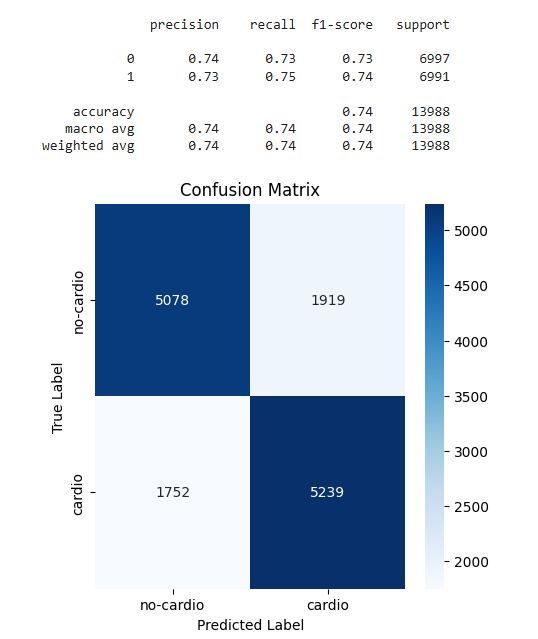
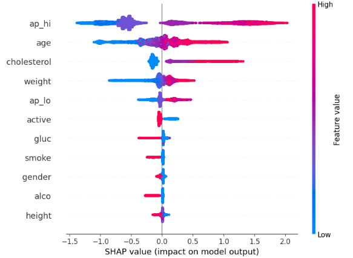
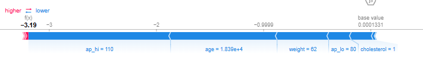

# Cardiovascular Disease Predictions

This project aims to classify patients that could potentially have cardiovascular diseases and not based on the dataset from Kaggle: [Cardiovascular Disease Dataset](https://www.kaggle.com/datasets/sulianova/cardiovascular-disease-dataset?resource=download) 

## Running the notebook in different ways:
1) Create a folder with the path /Colab/Cardiovascular/ on your Google Drive, download and unzip the dataset so it's accessible after mounting the drive through the path /content/drive/MyDrive/Colab/Cardiovascular/cardio_train.csv.
2) Download the dataset to the runtime storage on Google Colab and assign a new URL as an empty string url="".
3) Clone the repository, create the virtual environment, install libraries from requirements.txt, and download and unzip the dataset into the cloned repository.

## Dataset
The dataset consists of features based on examinations and patient self-reporting. There are no missing values. Patients are between 26 and 65 years of age, with an imbalance between genders. The most unclean columns are related to blood pressure. We manually identified issues of wrongly written values and mismatches between systolic and diastolic blood pressure. We also removed outliers within reasonable ranges (domain knowledge expert desirable to confirm how the data was collected and what ranges are actually acceptable).

## Modeling
We used several approaches to create additional features, such as PCA, KMeans clusters, target mean of the 5 nearest neighbors, and mathematical features (sums, BMI, divisions). Although some features initially showed statistically significant relationships with the target, they introduced more noise and lowered the cross-validated accuracy in the models. Feature selection based on removing multicollinearity and using the Boruta library also lowered the metrics.

In the end, we tuned the hyperparameters of the XGBClassifier on the original dataset, achieving 0.74 accuracy on the test data compared to 0.72 using a base logistic regression classifier. We also set the threshold based on threshold-dependent metrics.

After hardcoding the threshold to 0.45, we achieved the following results.

Using the SHAP library, we identified the most important features:

The graph suggests potential problems with the model, particularly the bias favoring a cluster of patients with associated high-risk features into 'cardio' patients and the rest otherwise. Patients who don't display those features are classified as false negatives. Here is an example of such a patient where the model was sure about not having cardiovascular problems:

## Conclusions
The model has a tendency to classify individuals with the following characteristics as being at higher risk for cardiovascular disease: high cholesterol, older age, higher weight, and higher blood pressure. However, there are still one-third of individuals who exhibit these characteristics and remain healthy, as well as individuals who do not exhibit these characteristics but are prone to cardiovascular disease.

To improve the model's performance, we could potentially explore individuals who were misclassified, both false positives and false negatives, to identify additional features that could enhance accuracy. While creating additional features based on domain knowledge, target mean of the five nearest neighbors, and classification into five different clusters was attempted, it introduced more noise into the models.

Despite these challenges, we were able to improve the model's performance from a baseline accuracy of *0.72* to *0.74* by employing more sophisticated algorithms and hyperparameter tuning. However, feature selection often led to the loss of crucial information necessary for accurate predictions.
